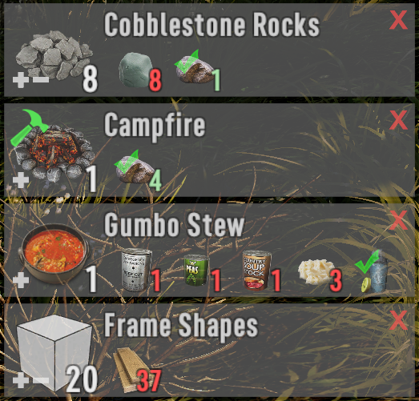

# Alternative UI for OCB Pin Recipes Mod - 7 Days to Die (V1.0 exp) Addon

This needs [OCB Pin Recipes Mod][1] installed in order to work. It will
change the UI for better readability. Based on work done by [tdrhart][2]
as posted in the [original mod thread][2] (thanks). I slightly adjusted
it to fit a bit closer to the original UI.

[![GitHub CI Compile Status][4]][3]

## Download and Install

End-Users are encouraged to download my mods from [NexusMods][5].  
Every download there helps me to buy stuff for mod development.

Otherwise please use one of the [official releases][6] here.  
Only clone or download the repo if you know what you do!

## Changelog

### Version 0.9.1

- Better compatibility for Afterlife Overhaul

### Version 0.9.0

- Update for OcbPinRecipes Version 0.9.0
- Add new direct quality recipe crafting

### Version 0.4.0

- Update for OcbPinRecipes Version 0.8.4
- Add default controller binding (DPad-Down)

### Version 0.3.1

- Update for OcbPinRecipes Version 0.6.1
- Add double click feature for ingredients

### Version 0.3.0

- Update for OcbPinRecipes Version 0.6.0
- Add button for "Grab ingredients" function
- Set key-binding for "Grab ingredients" to `G`
- Automated deployment and release packaging

### Version 0.2.0

- Update for OcbPinRecipes Version 0.5.0
- Adds a sprite to indicate locked recipes
- Enables scroll wheel for recipe count

### Version 0.1.0

- Initial version

[1]: https://github.com/OCB7D2D/OcbPinRecipes
[2]: https://community.7daystodie.com/topic/26859-pin-recipes-mod/?do=findComment&comment=466832
[3]: https://github.com/OCB7D2D/OcbPinRecipesUiTdrHart/actions/workflows/ci.yml
[4]: https://github.com/OCB7D2D/OcbPinRecipesUiTdrHart/actions/workflows/ci.yml/badge.svg
[5]: https://www.nexusmods.com/7daystodie/mods/1850
[6]: https://github.com/OCB7D2D/OcbPinRecipesUiTdrHart/releases